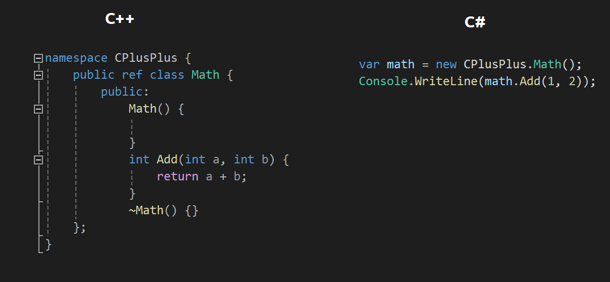
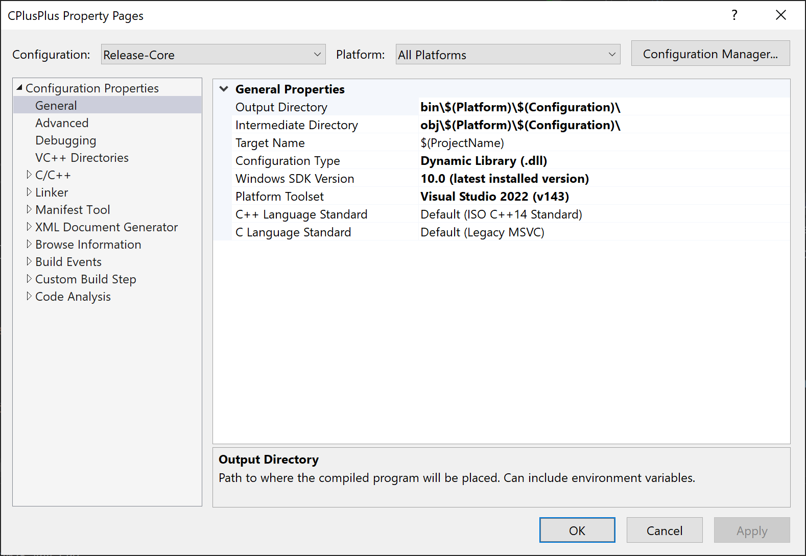
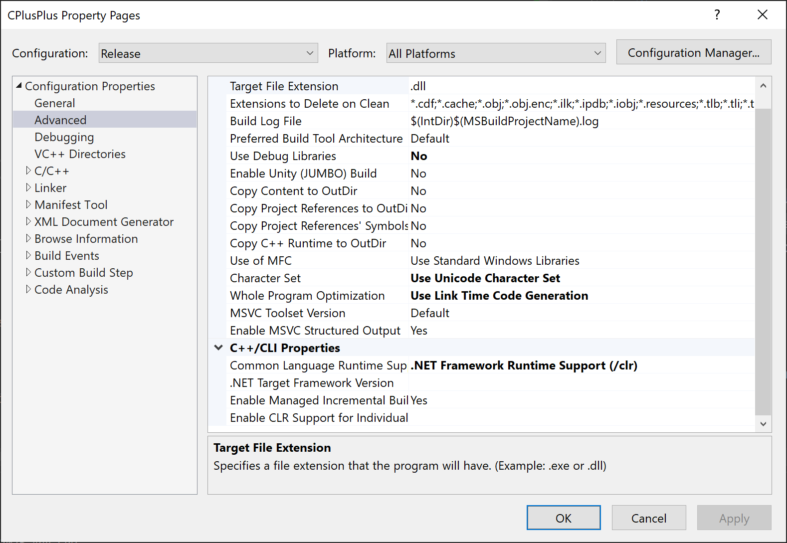

# RevitAddin.DllImport.Example

Simple project example with a `C++` dll and a `RevitAddin` project, using `DllImport` to call the dll functions.

This project was generated by the [ricaun.AppLoader](https://ricaun.com/AppLoader/) Revit plugin.

## CPlusPlus

This project have this simple `Math` class, this way is not needed to use `DllImport` to call the dll functions.

### Configuration

#### Output

The output of the `CPlusPlus` project was changed in all configurations to the `bin` and `obj` folder to make similar like `csproj`.

#### .NET Framework and .NET Core

To make work in Revit the `CPlusPlus` project need to be configured to `.NET Framework` and `.NET Core` configurations with platform `x64`.

## Installation

* Download and install [RevitAddin.DllImport.Example.exe](../../releases/latest/download/RevitAddin.DllImport.Example.zip)

## License

This project is [licensed](LICENSE) under the [MIT License](https://en.wikipedia.org/wiki/MIT_License).

---

Do you like this project? Please [star this project on GitHub](../../stargazers)!